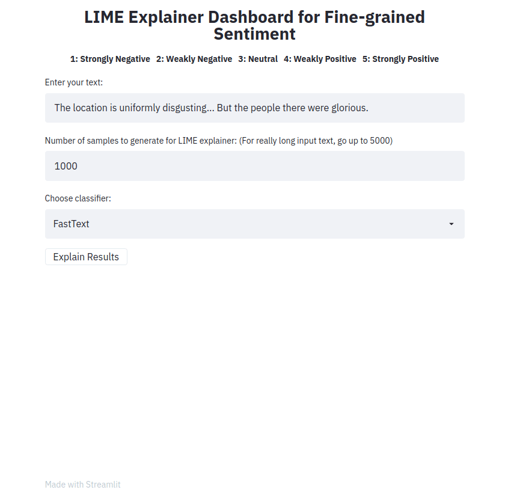

# A Streamlit Explainer App for Fine Grained Sentiment Classification

This repo contains the Streamlit equivalent of an existing interactive application, that explains the results of fine-grained sentiment classification, described in detail in [this Medium Series](https://medium.com/@tech_optimist/fine-grained-sentiment-analysis-in-python-part-2-2a92fdc0160d).

A number of classifiers are implemented and their results explained using the [LIME explainer](https://arxiv.org/pdf/1602.04938.pdf). 
The classifers were trained on the  [Stanford Sentiment Treebank](https://nlp.stanford.edu/sentiment/) (SST-5) dataset. The class labels are any of `[1, 2, 3, 4, 5]`, where `1` is very negative and `5` is very positive. 

## Why Streamlit?
[Streamlit](https://www.streamlit.io/) is a light-weight, minimalistic framework to build dashboards in Python. The main focus of Streamlit is to provide developers with the ability to rapidly prototype their UI designs using as few lines of code as possible. All the heavy lifting typically required to deploy a web application, such as defining the backend server and its routes, handling HTTP requests, etc., are abstracted away from the user. As a result, it becomes very easy to quickly implement a web app, regardless of the developer's experience.


## Installation

First, set up virtual environment and install from `requirements.txt`:

    python3 -m venv venv
    source venv/bin/activate
    pip3 install -r requirements.txt

For further development, simply activate the existing virtual environment.

    source venv/bin/activate


## Usage

After the virtual environment is set up and activated, run the app using the command below.

```sh
streamlit run app.py
```

Enter a sentence, choose a type of classifier and click on the button `Explain results`. We can then observe the features (i.e. words or tokens) that contributed to the classifier predicting a particular class label.

## Demo for the front-end

The front-end app takes in a text sample and outputs LIME explanations for the different methods. The app is is deployed using Heroku at this location: https://sst5-explainer-streamlit.herokuapp.com/

Play with your own text examples as shown below and see the fine-grained sentiment results explained!

**NOTE:** Because the PyTorch-based models (Flair and the causal transformer) are quite expensive to run inference with (they require a GPU), these methods are not deployed. However, they can be run on a local instance of the app.

